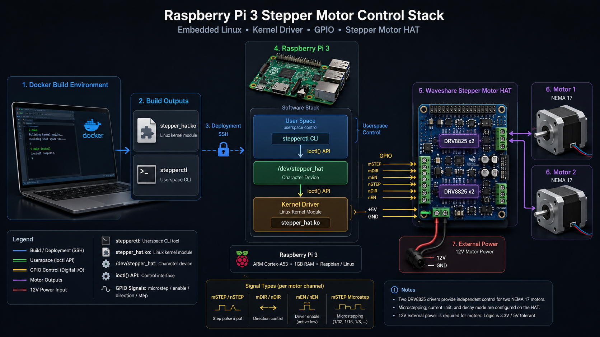

# Raspberry Pi 3 Stepper Motor HAT Driver

Copyright (c) Borys Nykytiuk <borysworking@gmail.com>



This repository contains a Linux kernel module and a user-space CLI for the
Waveshare Stepper Motor HAT on a Raspberry Pi 3.

Project layout:

- `kernel_module/`: kernel driver that exposes `/dev/stepper_hat`
- `userspace/stepperctl/`: CLI for the driver ioctl API
- `include/uapi/`: shared ioctl contract used by kernel and user space
- `rpi3-kernel-headers/`: Raspberry Pi 3 kernel headers used by the Docker build
- `documentation/`: vendor PDFs and board reference material

## Build in Docker

Build the toolchain image:

```sh
docker build -t rp3-stepper-build .
```

Build the kernel module:

```sh
docker run --rm -v "$PWD":/workspace -w /workspace/kernel_module \
  rp3-stepper-build bash -lc 'make clean && make'
```

Build the CLI:

```sh
docker run --rm -v "$PWD":/workspace -w /workspace/userspace/stepperctl \
  rp3-stepper-build bash -lc 'make clean && make CROSS_COMPILE=aarch64-linux-gnu-'
```

Artifacts:

- `build/kernel_module/stepper_hat.ko`
- `build/stepperctl/stepperctl`

## Deploy to Raspberry Pi

Copy both artifacts to the Pi:

```sh
scp build/kernel_module/stepper_hat.ko build/stepperctl/stepperctl rpi-3b_home:/tmp/
```

Install the CLI on the Pi:

```sh
ssh rpi-3b_home 'sudo install -m 0755 /tmp/stepperctl /usr/local/bin/stepperctl'
```

Load the driver:

```sh
ssh rpi-3b_home 'sudo insmod /tmp/stepper_hat.ko'
```

Check that it registered successfully:

```sh
ssh rpi-3b_home 'dmesg | tail -n 20'
```

Expected messages include:

- `using gpiochip 'pinctrl-bcm2835' base ...`
- `registered /dev/stepper_hat for two DRV8825 channels`

## Access without sudo

Create a `udev` rule so members of the `gpio` group can access the device:

```sh
ssh rpi-3b_home "echo 'KERNEL==\"stepper_hat\", GROUP=\"gpio\", MODE=\"0660\"' | sudo tee /etc/udev/rules.d/99-stepper-hat.rules >/dev/null"
ssh rpi-3b_home 'sudo udevadm control --reload-rules && sudo udevadm trigger'
ssh rpi-3b_home 'sudo rmmod stepper_hat && sudo insmod /tmp/stepper_hat.ko'
```

After that, `/dev/stepper_hat` should look like:

```sh
crw-rw---- root gpio ...
```

## Hardware bring-up checklist

Before testing motion, verify all of the following:

- External motor supply is connected to the HAT and powered on.
- Motor coil pairs are wired correctly.
- DRV8825 current limit is adjusted high enough for the motor.
- DIP switches are set for hardware full-step during initial testing.

For the Waveshare board, start with all DIP switches in `0` (`OFF`):

- `D0 D1 D2` control microstep selection for `M1`
- `D3 D4 D5` control microstep selection for `M2`
- for first tests, set `D0-D5 = 0`

For the `17HS4023` motors tested on this setup, the working coil pairs were:

- `Black + Green`
- `Red + Blue`

Wire one pair to `A1/A2` and the other pair to `B1/B2`.
If direction is reversed, swap only within one pair.

## First smoke test

Configure one motor for a slow visible move:

```sh
stepperctl configure --motor 1 --control hardware --microstep full --hold off --delay-us 50000
stepperctl status --motor 1
stepperctl enable --motor 1 --on
stepperctl move --motor 1 --dir forward --steps 50 --wait
stepperctl move --motor 1 --dir backward --steps 50 --wait
stepperctl enable --motor 1 --off
```

If the motor does not move or hold torque:

- re-check coil pairing
- re-check that the motor is connected to the expected channel (`M1` or `M2`)
- increase the DRV8825 current limit carefully
- confirm the external motor supply is still present under load

## Notes

- The driver uses Linux-scheduled GPIO pulses, so it is suitable for moderate
  speeds and bring-up, not hard real-time motion control.
- The current driver defaults to hardware microstep control, which matches the
  DIP switch configuration on the Waveshare HAT.
- The tested Raspberry Pi kernel line is `6.12.47+rpt-rpi-v8`.

See also:

- [kernel_module/README.md](kernel_module/README.md)
- [userspace/stepperctl/README.md](userspace/stepperctl/README.md)

## License

This project is licensed under the GPL-2.0-only license.
